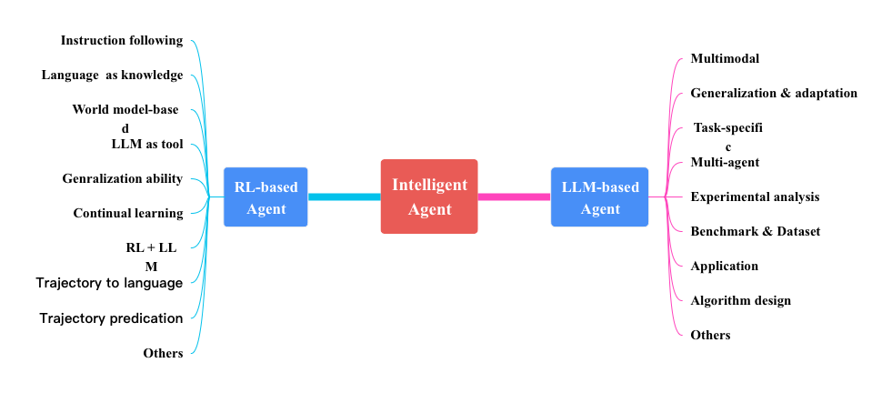

# Awesome-Papers-Autonomous-Agent

This is a collection of recent papers focusing on autonomous agent. Here is how Wikipedia defines Agent:

> In artificial intelligence, an intelligent agent is an agent acting in an intelligent manner; It perceives its environment, takes actions autonomously in order to achieve goals, and may improve its performance with learning or acquiring knowledge. An intelligent agent may be simple or complex: A thermostator other control systemis considered an example of an intelligent agent, as is a human being, as is any system that meets the definition, such as a firm, a state, or a biome.

Thus, the key of an agent is that it can <i>achieve goals</i>, <i>acquire knowledge</i> and <i>continually improve</i>.
The traditional agents in RL research will not be considered in this collection.
Though LLM-based agents have caught people's eyes in recent research, RL-based agents also take their special position.
Specifically, this repo is interested in two types of agent: RL-based agent and LLM-based agent. 

Note that this paper list is **under active maintaince**. Free free to open an issue if you found any missed papers that fit the topic.

------

## Update history

- 2023/12/08: Add papers accepted by [ICML'23](https://icml.cc/virtual/2023/papers.html?filter=titles) and [ICLR'23]() :rocket:
- 2023/11/08: Add papers accepted by [NeurIPS'23](https://openreview.net/group?id=NeurIPS.cc/2023/Conference&referrer=%5BHomepage%5D(%2F)). Add related links (project page or github) to these accepted papers :tada:
- 2023/10/25: Classify all papers based on their research topics. Check ToC for the standard of classification :clap:
- 2023/10/18: Release first version of collection, including papers submitted to [ICLR 2024](https://openreview.net/group?id=ICLR.cc/2024/Conference) :rocket:

<!-- START doctoc generated TOC please keep comment here to allow auto update -->
<!-- DON'T EDIT THIS SECTION, INSTEAD RE-RUN doctoc TO UPDATE -->
**Table of Contents**

- [RL-based agent](#rl-based-agent)
  - [Instruction following](#instruction-following)
  - [Build agent based on World model](#build-agent-based-on-world-model)
  - [Language as knowledge](#language-as-knowledge)
  - [LLM as a tool](#llm-as-a-tool)
  - [Generalization across tasks](#generalization-across-tasks)
  - [Continual learning](#continual-learning)
  - [Combine RL and LLM](#combine-rl-and-llm)
  - [Transformer-based policy](#transformer-based-policy)
  - [Trajectory to language](#trajectory-to-language)
  - [Trajectory predication](#trajectory-predication)
  - [Others](#others)
- [LLM-based agent](#llm-based-agent)
  - [Multimodal](#multimodal)
  - [Train LLM for generalization & adaptation](#train-llm-for-generalization--adaptation)
  - [Task-specific designing](#task-specific-designing)
  - [Multi-agent (e.g., society, coperation)](#multi-agent-eg-society-coperation)
  - [Experimental analysis](#experimental-analysis)
  - [Benchmark & Dataset](#benchmark--dataset)
  - [Applications](#applications)
  - [Algorithm design](#algorithm-design)
  - [Combined with RL](#combined-with-rl)
  - [Others](#others-1)

<!-- END doctoc generated TOC please keep comment here to allow auto update -->

------

## RL-based agent

### Instruction following
- [NeurIPS'23] [Natural Language-conditioned Reinforcement Learning with Inside-out Task Language Development and Translation](https://arxiv.org/abs/2302.09368)
- [NeurIPS'23] [Guide Your Agent with Adaptive Multimodal Rewards](https://openreview.net/attachment?id=G8nal7MpIQ&name=pdf) [[project](https://sites.google.com/view/2023arp)]
- [Compositional Instruction Following with Language Models and Reinforcement Learning](https://openreview.net/forum?id=lIwp1C1eSK)
- [RT-1: Robotics Transformer for Real-World Control at Scale](https://arxiv.org/abs/2212.06817) [[blog](https://blog.research.google/2022/12/rt-1-robotics-transformer-for-real.html)]
- [RT-2: Vision-Language-Action Models Transfer Web Knowledge to Robotic Control](https://robotics-transformer2.github.io/assets/rt2.pdf) [[blog](https://deepmind.google/discover/blog/rt-2-new-model-translates-vision-and-language-into-action/)]
- [Open X-Embodiment: Robotic Learning Datasets and RT-X Models](https://arxiv.org/abs/2310.08864) [[blog](https://deepmind.google/discover/blog/scaling-up-learning-across-many-different-robot-types/)]
- [NeurIPS'23] [Guide Your Agent with Adaptive Multimodal Rewards](https://openreview.net/attachment?id=G8nal7MpIQ&name=pdf) [[project](https://sites.google.com/view/2023arp)]
- [LEO: An Embodied Generalist Agent in 3D World](https://arxiv.org/abs/2311.12871) [[project](https://embodied-generalist.github.io/)]

### Build agent based on World model
- [ICLR'23 Oral] [Transformers are Sample-Efficient World Models](https://openreview.net/forum?id=vhFu1Acb0xb) [[code](https://github.com/eloialonso/iris)]
- [Learning to Model the World with Language](https://openreview.net/forum?id=eWLOoaShEH)
- [MAMBA: an Effective World Model Approach for Meta-Reinforcement Learning](https://openreview.net/forum?id=1RE0H6mU7M)

### Language as knowledge 
- [Learning with Language Inference and Tips for Continual Reinforcement Learning](https://openreview.net/forum?id=zEhTnQZB3D)
- [Informing Reinforcement Learning Agents by Grounding Natural Language to Markov Decision Processes](https://openreview.net/forum?id=P4op21eju0)
- [Language Reward Modulation for Pretraining Reinforcement Learning](https://openreview.net/forum?id=SWRFC2EupO)

### LLM as a tool

- [NeurIPS'23] [Efficient Policy Adaptation with Contrastive Prompt Ensemble for Embodied Agents](https://openreview.net/forum?id=Ny3GcHLyzj)
- [ICLR'23] [Reward Design with Language Models](https://openreview.net/forum?id=10uNUgI5Kl) [[code](https://github.com/minaek/reward_design_with_llms)]
- [ICML'23] [RLang: A Declarative Language for Describing Partial World Knowledge to Reinforcement Learning Agents](https://icml.cc/virtual/2023/poster/24583) [[Poster](https://icml.cc/media/PosterPDFs/ICML%202023/24583.png?t=1688077847.801905)]
- [ICML'23] [Do Embodied Agents Dream of Pixelated Sheep: Embodied Decision Making using Language Guided World Modelling](https://icml.cc/virtual/2023/poster/24286) [[Project](https://deckardagent.github.io/)][[Code](https://github.com/DeckardAgent/deckard)]
- [ICML'23] [https://icml.cc/virtual/2023/poster/23938](https://icml.cc/virtual/2023/poster/23938)
- [Leveraging Large Language Models for Optimised Coordination in Textual Multi-Agent Reinforcement Learning](https://openreview.net/forum?id=1PPjf4wife)
- [Text2Reward: Dense Reward Generation with Language Models for Reinforcement Learning](https://openreview.net/forum?id=tUM39YTRxH)
- [Language to Rewards for Robotic Skill Synthesis](https://language-to-reward.github.io )
- [Eureka: Human-Level Reward Design via Coding Large Language Models](https://eureka-research.github.io)
- [STARLING: Self-supervised Training of Text-based Reinforcement Learning Agent with Large Language Models](https://openreview.net/forum?id=LXiG2WqKXR)

### Generalization across tasks
- [A Generalist Agent](https://arxiv.org/abs/2205.06175)
- [AMAGO: Scalable In-Context Reinforcement Learning for Adaptive Agents](https://openreview.net/forum?id=M6XWoEdmwf)

### Continual learning
- [ADAPTER-RL: Adaptation of Any Agent using Reinforcement Learning](https://openreview.net/forum?id=LVp217SAtb)
- [Online Continual Learning for Interactive Instruction Following Agents](https://openreview.net/forum?id=7M0EzjugaN)
- [NeurIPS'23] [A Definition of Continual Reinforcement Learning](https://openreview.net/attachment?id=ZZS9WEWYbD&name=pdf)

### Combine RL and LLM
- [NeurIPS'23] [Large Language Models Are Semi-Parametric Reinforcement Learning Agents](https://openreview.net/forum?id=ZcJa1R6j3v)
- [RoboGPT : An intelligent agent of making embodied long-term decisions for daily instruction tasks](https://openreview.net/forum?id=x4fm4T2tjM)
- [Can Language Agents Approach the Performance of RL? An Empirical Study On OpenAI Gym](https://openreview.net/forum?id=F0q880yOgY)
- [RLAdapter: Bridging Large Language Models to Reinforcement Learning in Open Worlds](https://openreview.net/forum?id=3s4fZTr1ce)

### Transformer-based policy
- [NeurIPS'23] [Cross-Episodic Curriculum for Transformer Agents](https://openreview.net/forum?id=afKnrwJBAl). [[project](https://cec-agent.github.io/)]

### Trajectory to language
- [NeurIPS'23] [State2Explanation: Concept-Based Explanations to Benefit Agent Learning and User Understanding](https://openreview.net/attachment?id=xGz0wAIJrS&name=pdf)
- [NeurIPS'23] [Semantic HELM: A Human-Readable Memory for Reinforcement Learning](https://openreview.net/pdf?id=ebMPmx5mr7)
- [ICML'23] [Distilling Internet-Scale Vision-Language Models into Embodied Agents](https://icml.cc/virtual/2023/poster/24664)
- [Understanding Your Agent: Leveraging Large Language Models for Behavior Explanation](https://openreview.net/forum?id=PKsTHJXn4d)

### Trajectory predication
- [Multi-agent Trajectory Prediction with Scalable Diffusion Transformer](https://openreview.net/forum?id=crP1HxQ5iw)

### Others
- [Enhancing Human Experience in Human-Agent Collaboration: A Human-Centered Modeling Approach Based on Positive Human Gain](https://openreview.net/forum?id=BqEvdOS1Hs)
- [A Competition Winning Deep Reinforcement Learning Agent in microRTS](https://openreview.net/forum?id=6ssOs9BBxa)
- [Aligning Agents like Large Language Models](https://openreview.net/forum?id=kQqZVayz07)

------

## LLM-based agent

### Multimodal

- [ICML'23] [PaLM-E: An Embodied Multimodal Language Model](https://icml.cc/virtual/2023/poster/23969)
- [Steve-Eye: Equipping LLM-based Embodied Agents with Visual Perception in Open Worlds](https://openreview.net/forum?id=NltzxpG0nz)
- [Multimodal Web Navigation with Instruction-Finetuned Foundation Models](https://openreview.net/forum?id=efFmBWioSc)
- [You Only Look at Screens: Multimodal Chain-of-Action Agents](https://openreview.net/forum?id=iSAgvYhZzg)
- [Learning Embodied Vision-Language Programming From Instruction, Exploration, and Environmental Feedback](https://openreview.net/forum?id=VUA9LSmC2r)
- [An Embodied Generalist Agent in 3D World](https://openreview.net/forum?id=4QaKdsh15T)
- [JARVIS-1: Open-world Multi-task Agents with Memory-Augmented Multimodal Language Models](https://arxiv.org/abs/2311.05997)

### Train LLM for generalization & adaptation

- [FireAct: Toward Language Agent Finetuning](https://openreview.net/forum?id=RqUMWdDg52)
- [Adapting LLM Agents Through Communication](https://openreview.net/forum?id=wOelVq8fwL)
- [AgentTuning: Enabling Generalized Agent Abilities for LLMs](https://openreview.net/forum?id=OqlmgmS4Wr)
- [Retroformer: Retrospective Large Language Agents with Policy Gradient Optimization](https://openreview.net/forum?id=KOZu91CzbK)

### Task-specific designing

- [NeurIPS'23] [Describe, Explain, Plan and Select: Interactive Planning with LLMs Enables Open-World Multi-Task Agents](https://openreview.net/forum?id=KtvPdGb31Z)
- [NeurIPS'23] [SwiftSage: A Generative Agent with Fast and Slow Thinking for Complex Interactive Tasks](https://openreview.net/forum?id=Rzk3GP1HN7) [[Github](https://github.com/yuchenlin/SwiftSage)]
- [Rethinking the Buyer’s Inspection Paradox in Information Markets with Language Agents](https://openreview.net/forum?id=6werMQy1uz)
- [A Language-Agent Approach to Formal Theorem-Proving](https://openreview.net/forum?id=XCMbagV0No)
- [Agent Instructs Large Language Models to be General Zero-Shot Reasoners](https://openreview.net/forum?id=zIJFG7wW2d)
- [Ghost in the Minecraft: Hierarchical Agents for Minecraft via Large Language Models with Text-based Knowledge and Memory](https://openreview.net/forum?id=cTOL99p5HL)
- [PaperQA: Retrieval-Augmented Generative Agent for Scientific Research](https://openreview.net/forum?id=clU5xWyItb)
- [Language Agents for Detecting Implicit Stereotypes in Text-to-image Models at Scale](https://openreview.net/forum?id=XW0gD13oQp)
- [Suspicion-Agent: Playing Imperfect Information Games with Theory of Mind Aware GPT-4](https://arxiv.org/abs/2309.17277)

### Multi-agent (e.g., society, coperation)
- [Building Cooperative Embodied Agents Modularly with Large Language Models](https://openreview.net/forum?id=EnXJfQqy0K)
- [OKR-Agent: An Object and Key Results Driven Agent System with Hierarchical Self-Collaboration and Self-Evaluation](https://openreview.net/forum?id=Mngdhgi711)
- [MetaGPT: Meta Programming for Multi-Agent Collaborative Framework](https://openreview.net/forum?id=VtmBAGCN7o)
- [AutoAgents: A Framework for Automatic Agent Generation](https://openreview.net/forum?id=PhJUd3mbhP)
- [Dynamic LLM-Agent Network: An LLM-agent Collaboration Framework with Agent Team Optimization](https://openreview.net/forum?id=i43XCU54Br)
- [AgentVerse: Facilitating Multi-Agent Collaboration and Exploring Emergent Behaviors](https://openreview.net/forum?id=EHg5GDnyq1)
- [Exploring Collaboration Mechanisms for LLM Agents: A Social Psychology View](https://openreview.net/forum?id=ueqTjOcuLc)
- [REX: Rapid Exploration and eXploitation for AI agents](https://openreview.net/forum?id=8TAGx549Ns)

### Experimental analysis

- [Identifying the Risks of LM Agents with an LM-Emulated Sandbox](https://openreview.net/forum?id=GEcwtMk1uA)
- [Evaluating Multi-Agent Coordination Abilities in Large Language Models](https://openreview.net/forum?id=OEDM8mzbsl)
- [Large Language Models as Gaming Agents](https://openreview.net/forum?id=iS3fQooCaa)
- [Benchmarking Large Language Models as AI Research Agents](https://openreview.net/forum?id=N9wD4RFWY0)
- [Adaptive Environmental Modeling for Task-Oriented Language Agents](https://openreview.net/forum?id=H0RztJssmQ)
- [CLIN: A Continually Learning Language Agent for Rapid Task Adaptation and Generalization](https://openreview.net/forum?id=d5DGVHMdsC)

### Benchmark & Dataset

- [ICLR'23] [Task Ambiguity in Humans and Language Models](https://openreview.net/forum?id=QrnDe_9ZFd8) [[code](https://github.com/kunhanda/task_ambiguity)]
- [SmartPlay : A Benchmark for LLMs as Intelligent Agents](https://openreview.net/forum?id=S2oTVrlcp3)
- [AgentBench: Evaluating LLMs as Agents](https://openreview.net/forum?id=zAdUB0aCTQ)
- [Put Your Money Where Your Mouth Is: Evaluating Strategic Planning and Execution of LLM Agents in an Auction Arena](https://openreview.net/forum?id=crMMk4I8Wy)
- [SOTOPIA: Interactive Evaluation for Social Intelligence in Language Agents](https://openreview.net/forum?id=mM7VurbA4r)
- [SocioDojo: Building Lifelong Analytical Agents with Real-world Text and Time Series](https://openreview.net/forum?id=s9z0HzWJJp)
- [WebArena: A Realistic Web Environment for Building Autonomous Agents](https://openreview.net/forum?id=oKn9c6ytLx)
- [LLM-Deliberation: Evaluating LLMs with Interactive Multi-Agent Negotiation Game](https://openreview.net/forum?id=cfL8zApofK)
- [Evaluating Large Language Models at Evaluating Instruction Following](https://openreview.net/forum?id=tr0KidwPLc)
- [CivRealm: A Learning and Reasoning Odyssey for Decision-Making Agents](https://openreview.net/forum?id=UBVNwD3hPN)

### Applications

- [Lyfe Agents: generative agents for low-cost real-time social interactions](https://openreview.net/forum?id=VaZa8zj0Yw)
- [AutoGen: Enabling Next-Gen LLM Applications via Multi-Agent Conversation](https://openreview.net/forum?id=tEAF9LBdgu)

### Algorithm design
- [ICLR'23 Oral] [ReAct: Synergizing Reasoning and Acting in Language Models](https://openreview.net/forum?id=WE_vluYUL-X) [[code](https://www.catalyzex.com/paper/arxiv:2210.03629/code)]
- [NeurIPS'23] [AdaPlanner: Adaptive Planning from Feedback with Language Models](https://openreview.net/forum?id=rnKgbKmelt) [[github](https://github.com/haotiansun14/AdaPlanner)]
- [Prospector: Improving LLM Agents with Self-Asking and Trajectory Ranking](https://openreview.net/forum?id=YKK1jXEWja)
- [Formally Specifying the High-Level Behavior of LLM-Based Agents](https://openreview.net/forum?id=FRxDrdysBt)
- [Cumulative Reasoning With Large Language Models](https://arxiv.org/pdf/2308.04371.pdf)

### Combined with RL
- [NeurIPS'23] [Reflexion: language agents with verbal reinforcement learning](https://openreview.net/forum?id=vAElhFcKW6) [[code](https://github.com/noahshinn024/reflexion)]
- [Teaching LLMs to Teach Themselves Better Instructions via Reinforcement Learning](https://openreview.net/forum?id=wlRp8IdLkN)
- [Language Agents with Reinforcement Learning for Strategic Play in the Werewolf Game](https://openreview.net/forum?id=N1gmpVd4iE)

### Others
- [LUMOS: Towards Language Agents that are Unified, Modular, and Open Source](https://openreview.net/forum?id=VmnWoLbzCS)
- [Lemur: Harmonizing Natural Language and Code for Language Agents](https://openreview.net/forum?id=hNhwSmtXRh)
- [Language Agent Tree Search Unifies Reasoning Acting and Planning in Language Models](https://openreview.net/forum?id=6LNTSrJjBe)
